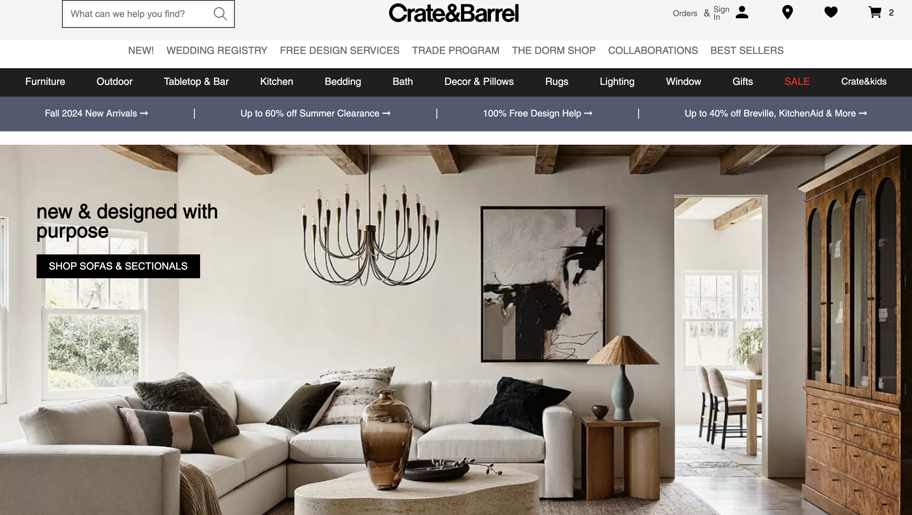
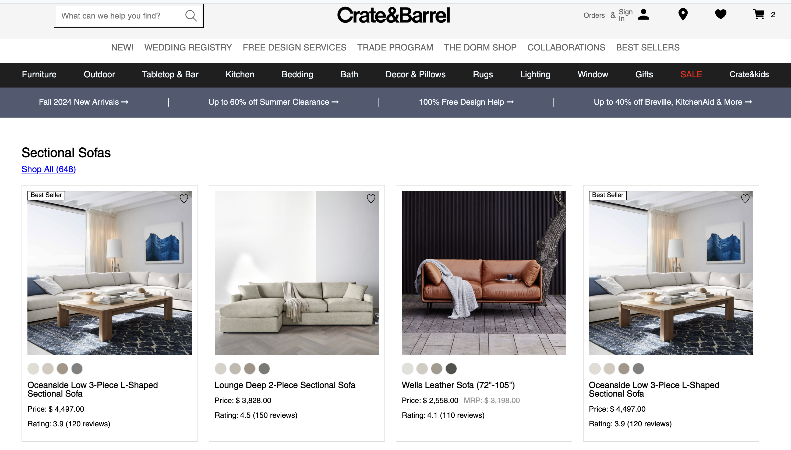
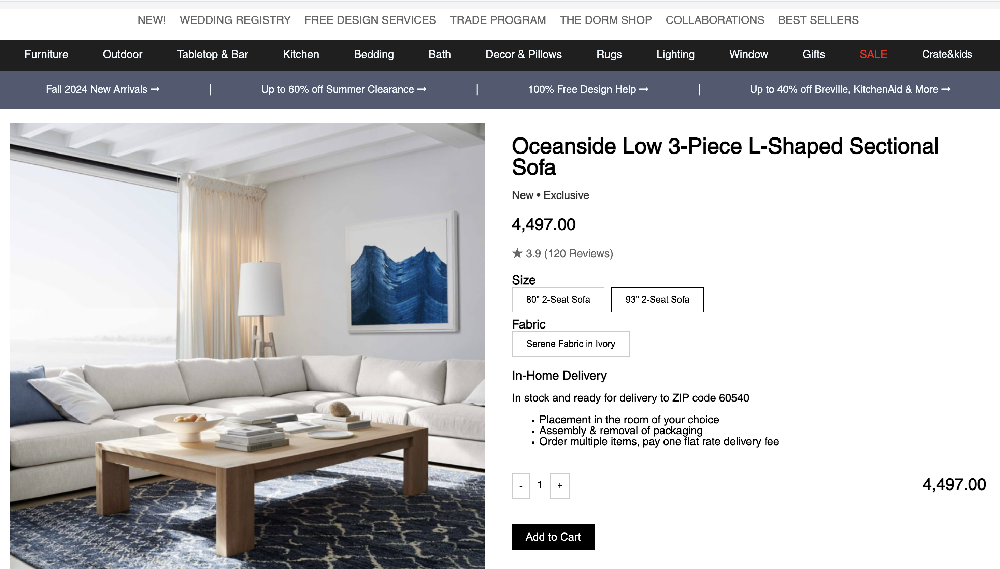
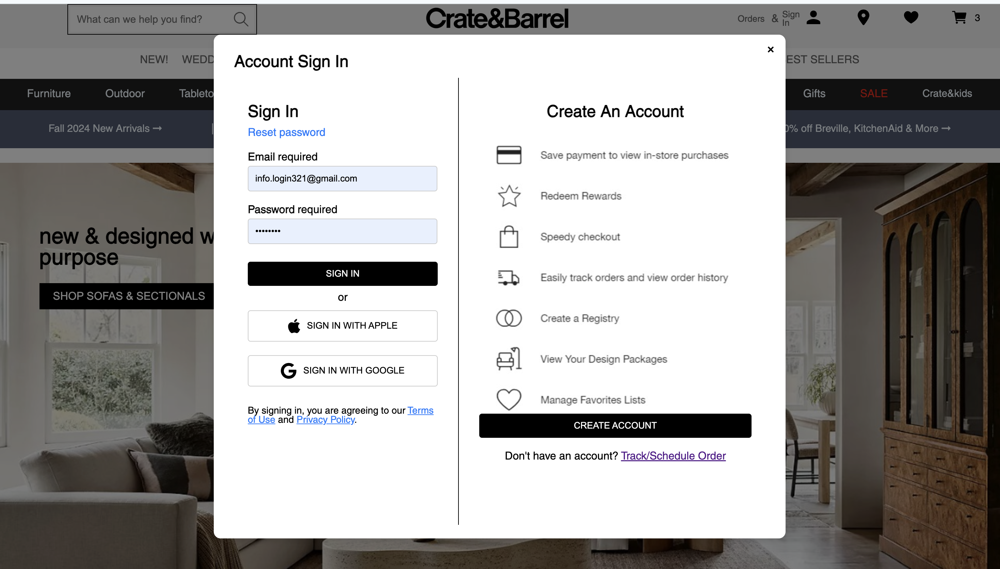
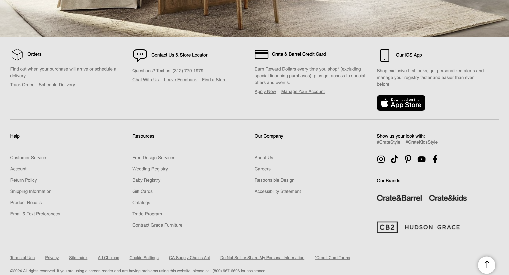

# E-Commerce Website Clone (Crate & Barrel Inspired)

A React-based e-commerce website inspired by Crate & Barrel, featuring product listings, cart functionality, and user authentication.

## Features
- Home page with featured categories and products
- Product listing with images, prices, and ratings
- Product detail pages
- Add to cart functionality
- User registration and login
- Admin: Add new products

## Screenshots

### Homepage



### Product Listing



### Product Detail


### Cart Page


### Login & Signup


### Footer


## Getting Started

### Prerequisites
- Node.js and npm installed

### Installation
1. Clone the repository:
   ```bash
   git clone https://github.com/AmitSahoo7/E-Commerce-Website-Clone.git
   cd E-Commerce-Website-Clone/final
   ```
2. Install dependencies:
   ```bash
   npm install
   ```

### Running the App
1. Start the backend (JSON Server):
   ```bash
   npx json-server db.json --port 3001
   ```
2. In a new terminal, start the React app:
   ```bash
   npm run dev
   ```
3. Open your browser and go to `http://localhost:5173`

## Folder Structure
```
final/
  ├── db.json                # Mock database for products and users
  ├── src/
  │   ├── components/        # Reusable React components
  │   ├── pages/             # Page components (Home, Product, Cart, etc.)
  │   └── assets/            # Images and videos
  ├── screenshots/           # Project screenshots for README
  ├── public/
  ├── package.json
  └── ...
```

## Future Improvements
- Deployment (Vercel/Netlify)
- Payment gateway integration
- Order history and user profile
- More admin features

## License
This project is for educational purposes only and is not affiliated with Crate & Barrel. 
